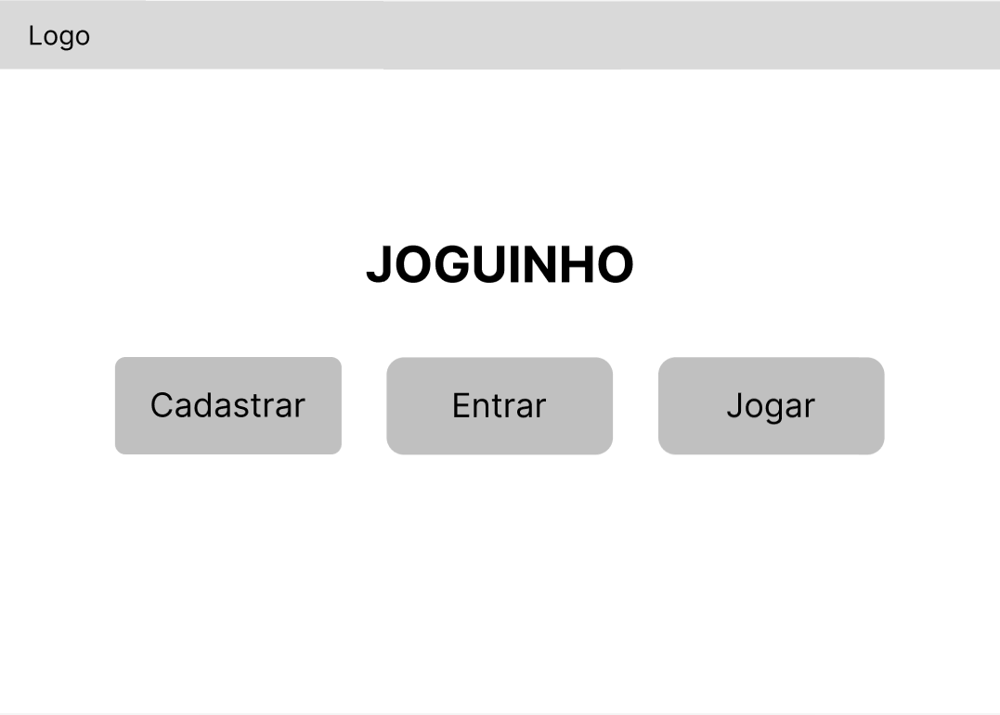
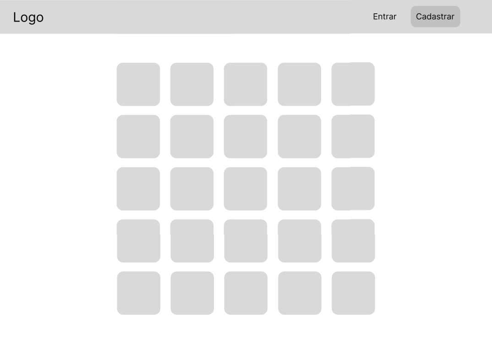
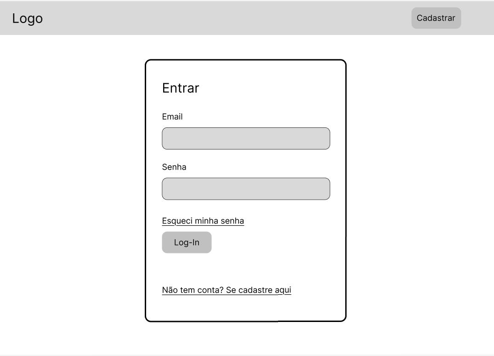
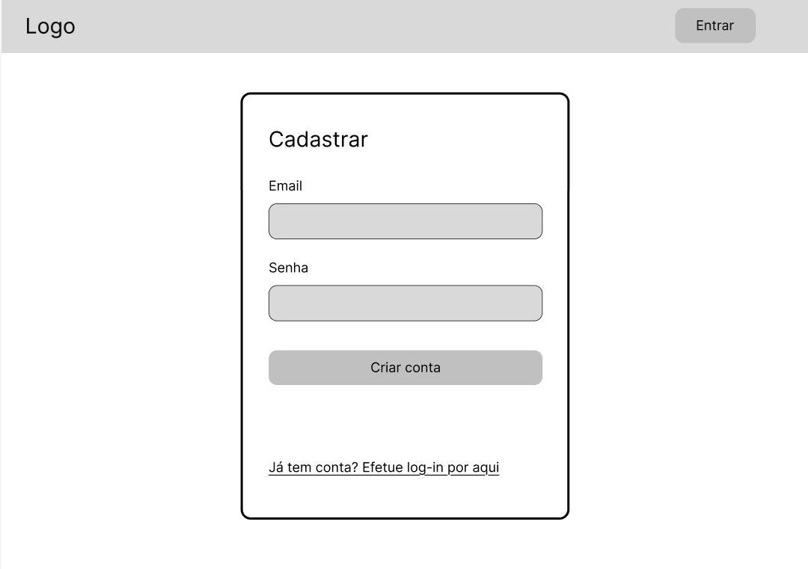

# Clone do Jogo Termooo
- Aluno: Daniel Ferreira Alves
- Curso: ADS B Noturno
- Matéria: Linguagem de Programação Web II
- Repositório do Projeto: https://github.com/Dandastico/CloneTermoooPHP

# Semana 1
## 1.1 Objetivo do Sistema
O sistema é uma cópia do jogo Termooo (versão mais famosa desse tipo de jogo em português) ou Wordle (versão mais famosa em inglês, desenvolvido pelo NY Times). O site deve permitir a criação de novos usuários, log-in e gerenciamento do usuário (edição e deleção).

O jogo terá as mesmas regras de negócio do jogo Termooo:
- O jogo irá escolher uma palavra por dia para ser o "alvo"
- O jogador pode tentar acertar o "alvo" 6 vezes com palavras de 5 letras
- O site mostrará o resultado da comparação do "chute" com o "alvo" utilizando cores:
  - Verde: letra certa na posição certa
  - Amarela: letra certa na posição errada
  - Preto: letra errada
- O jogador pode criar uma conta
- O jogador pode efetuar log-in
  - Quando o jogador efetua o log-in, ele pode ter um histórico de seus jogos

## Público-alvo
O sistema é destinado a jogadores casuais de jogos eletrônicos.

## Wireframes





## Arquitetura do Banco de Dados
Tabelas dos jogos
```sql

CREATE TABLE usuarios (
    id INT AUTO_INCREMENT PRIMARY KEY,
    username VARCHAR(50) NOT NULL,
    email VARCHAR(254) NOT NULL UNIQUE,
    senha_hash VARCHAR(255) NOT NULL
);

CREATE TABLE palavras (
    id INT AUTO_INCREMENT PRIMARY KEY,
    palavra VARCHAR(5) UNIQUE,
    dificuldade ENUM('facil', 'medio', 'dificil')
);

CREATE TABLE jogos (
    id INT AUTO_INCREMENT PRIMARY KEY,
    usuario_id INT,
    palavra_id INT,  -- referência à palavra secreta
    tentativas INT DEFAULT 0,
    max_tentativas INT DEFAULT 6,  -- limite de tentativa
    venceu BOOLEAN DEFAULT FALSE,
    data_inicio TIMESTAMP DEFAULT CURRENT_TIMESTAMP,
    data_fim TIMESTAMP NULL,
    FOREIGN KEY (usuario_id) REFERENCES usuarios(id) ON DELETE SET NULL, -- se usuário for deletado, permite manter o jogo
    FOREIGN KEY (palavra_id) REFERENCES palavras(id)
);
```

# Semana 02 -  Criação da Página Log-in
Nessa semana, criei o sistema de log-in para meu sistema:


Ela é bem simples, exigindo apenas e-mail e senha, sem opção de log-in por SSO.

O schema do banco de dados do CloneTermoo é:
```sql
CREATE TABLE usuarios (
    id INT AUTO_INCREMENT PRIMARY KEY,
    username VARCHAR(50) NOT NULL,
    email VARCHAR(254) NOT NULL UNIQUE,
    senha_hash VARCHAR(255) NOT NULL
);

CREATE TABLE palavras (
    id INT AUTO_INCREMENT PRIMARY KEY,
    palavra VARCHAR(5) UNIQUE,
    dificuldade ENUM('facil', 'medio', 'dificil')
);

CREATE TABLE jogos (
    id INT AUTO_INCREMENT PRIMARY KEY,
    usuario_id INT,
    palavra_id INT,  -- referência à palavra secreta
    tentativas INT DEFAULT 0,
    max_tentativas INT DEFAULT 6,  -- limite de tentativa
    venceu BOOLEAN DEFAULT FALSE,
    data_inicio TIMESTAMP DEFAULT CURRENT_TIMESTAMP,
    data_fim TIMESTAMP NULL,
    FOREIGN KEY (usuario_id) REFERENCES usuarios(id) ON DELETE SET NULL, -- se usuário for deletado, permite manter o jogo
    FOREIGN KEY (palavra_id) REFERENCES palavras(id)
```

Os arquivos desse sistema são organizados da seguinte forma:

```
📁 CloneTermoooPHP/ (Pasta raiz do projeto)
│
├── 📁 public/ (Esta é a pasta raiz do servidor web - "DocumentRoot")
│   │
│   ├── 📄 index.php          (Página principal do jogo)
│   ├── 📄 login.html          (O formulário de login)
│   ├── 📄 registrar.html      (O formulário de registro)
│   │
│   ├── 📄 processa_login.php    (Endpoint do AJAX)
│   ├── 📄 processa_registro.php (Endpoint do AJAX de registro)
│   ├── 📄 logout.php          (Script para destruir a sessão)
│   │
│   └── 📁 assets/ (Todos os arquivos CSS, JS e imagens)
│       ├── 📁 css/
│       │   ├── 📄 style_login.css
│       │   └── 📄 style_game.css
│       └── 📁 js/
│           ├── 📄 login.js
│           └── 📄 registrar.js
│
└── 📁 src/ (Código "privado" do backend e lógica de negócios)
    │
    ├── 📄 db_config.php       (A conexão com o BD)
    └── 📄 auth_check.php      (Um script para verificar se o usuário está logado)
```

## Códigos do projeto
A seguir, são apresentados os códigos que geram o sistema.

### Front-end
No front-end, as tecnologias utilizadas forma HTML, CSS e JS

**HTML da tela de login**
```html
<!DOCTYPE html>
<html lang="pt-BR">
<head>
    <meta charset="UTF-8">
    <meta name="viewport" content="width=device-width, initial-scale=1.0">
    <title>Login - Clone Termooo</title>
    <link rel="stylesheet" href="assets/css/style_login.css">
</head>
<body>

    <div class="login-container">
        <form id="loginForm">
            <h2>Login</h2>
            
            <div id="message" class="message"></div>

            <div class="input-group">
                <label for="loginUser">Usuário ou Email</label>
                <input type="text" id="loginUser" name="loginUser" required autocomplete="username">
            </div>

            <div class="input-group">
                <label for="loginPass">Senha</label>
                <input type="password" id="loginPass" name="loginPass" required autocomplete="current-password">
            </div>

            <button type="submit" id="loginButton">Entrar</button>

            <div class="link-registro">
                <p>Não tem uma conta? <a href="registrar.html">Registre-se</a></p>
            </div>
        </form>
    </div>

    <script src="assets/js/login.js"></script>
</body>
</html>
```

**JS da tela de login**
```js
document.addEventListener('DOMContentLoaded', () => {
    const loginForm = document.getElementById('loginForm');
    const messageDiv = document.getElementById('message');
    const loginButton = document.getElementById('loginButton');

    loginForm.addEventListener('submit', async (e) => {
        e.preventDefault(); // Impede o recarregamento da página

        // Desabilita o botão e mostra "Carregando..."
        loginButton.disabled = true;
        loginButton.textContent = 'Carregando...';
        messageDiv.className = 'message';
        messageDiv.textContent = '';

        // Coleta os dados do formulário
        const formData = new FormData(loginForm);
        const data = Object.fromEntries(formData.entries());

        try {
            const response = await fetch('processa_login.php', {
                method: 'POST',
                headers: {
                    'Content-Type': 'application/json'
                },
                body: JSON.stringify(data)
            });

            const result = await response.json();

            if (result.success) {
                // Sucesso
                messageDiv.textContent = 'Login bem-sucedido! Redirecionando...';
                messageDiv.className = 'message success';
                
                // Redireciona para a página principal do jogo (ex: index.php)
                setTimeout(() => {
                    // O destino deve ser a página principal do jogo
                    window.location.href = 'index.php'; 
                }, 2000);

            } else {
                // Erro
                messageDiv.textContent = result.message || 'Erro desconhecido.';
                messageDiv.className = 'message error';
                loginButton.disabled = false;
                loginButton.textContent = 'Entrar';
            }
        } catch (error) {
            console.error('Erro na requisição:', error);
            messageDiv.textContent = 'Erro de conexão com o servidor.';
            messageDiv.className = 'message error';
            loginButton.disabled = false;
            loginButton.textContent = 'Entrar';
        }
    });
});
```

### Back-End
O back-end desse projeto será todo desenvolvido por PHP

**db_config.php**

Responsável pela conexão do sistema com o banco de dados.

```php
<?php
// db_config.php
define('DB_HOST', 'localhost');
define('DB_USER', 'root');       // <-- Seu usuário do MySQL
define('DB_PASS', '');           // <-- Sua senha do MySQL
define('DB_NAME', 'termooo_db'); // O banco de dados da sua documentação
define('DB_CHARSET', 'utf8mb4');

$options = [
    PDO::ATTR_ERRMODE            => PDO::ERRMODE_EXCEPTION,
    PDO::ATTR_DEFAULT_FETCH_MODE => PDO::FETCH_ASSOC,
    PDO::ATTR_EMULATE_PREPARES   => false,
];

try {
    $dsn = "mysql:host=" . DB_HOST . ";dbname=" . DB_NAME . ";charset=" . DB_CHARSET;
    $pdo = new PDO($dsn, DB_USER, DB_PASS, $options);
} catch (PDOException $e) {
    // Em um ambiente de produção, você não deve exibir erros detalhados.
    // Você deve logar o erro e mostrar uma mensagem genérica.
    error_log($e->getMessage()); // Loga o erro no servidor
    
    // Resposta de erro genérica para o frontend (caso seja uma API)
    // header('Content-Type: application/json');
    // echo json_encode(['success' => false, 'message' => 'Erro de conexão com o banco de dados.']);
    
    // Ou uma página de erro
    die("Erro crítico de conexão com o banco de dados. Por favor, tente mais tarde.");
}
?>
```

**processa_login.php**

Segmenta as informações recebidas como arquivo JSON do documento login.js e verifica se o e-mail digitado pelo usuário e a senha correspondem com algum usuário já cadastrado no banco de dados, na tabela "usuarios".

```php
<?php
// processa_login.php

// 1. Inicia a sessão (ESSENCIAL para manter o usuário logado)
// Deve ser a primeira coisa no script
session_start();

// 2. Inclui a conexão com o banco
require '/../src/db_config.php';

// 3. Define o tipo de resposta como JSON
header('Content-Type: application/json');

// 4. Prepara a resposta padrão
$response = ['success' => false, 'message' => 'Requisição inválida.'];

// 5. Verifica se o método é POST
if ($_SERVER['REQUEST_METHOD'] === 'POST') {
    
    // Pega os dados JSON enviados pelo JavaScript
    $data = json_decode(file_get_contents('php://input'), true);

    // Validação básica
    if (empty($data['loginUser']) || empty($data['loginPass'])) {
        $response['message'] = 'Usuário/Email e senha são obrigatórios.';
        echo json_encode($response);
        exit;
    }

    $loginUser = trim($data['loginUser']); // Pode ser username ou email
    $password = $data['loginPass'];

    try {
        // 6. Prepara a query (Seguro contra SQL Injection)
        // O login funciona tanto com 'username' quanto com 'email'
        $sql = "SELECT id, username, senha_hash FROM usuarios WHERE username = :login OR email = :login LIMIT 1";
        
        $stmt = $pdo->prepare($sql);
        $stmt->execute(['login' => $loginUser]);
        
        $user = $stmt->fetch();

        // 7. Verifica se o usuário existe E se a senha está correta
        if ($user && password_verify($password, $user['senha_hash'])) {
            
            // SUCESSO!
            
            // 8. Regenera o ID da sessão para evitar "Session Fixation"
            session_regenerate_id(true);
            
            // 9. Armazena os dados do usuário na sessão
            $_SESSION['user_id'] = $user['id'];
            $_SESSION['username'] = $user['username'];
            $_SESSION['logged_in'] = true;

            $response['success'] = true;
            $response['message'] = 'Login bem-sucedido!';

        } else {
            // Falha (usuário não encontrado ou senha errada)
            // Usamos uma mensagem genérica por segurança
            $response['message'] = 'Usuário ou senha inválidos.';
        }

    } catch (PDOException $e) {
        // Loga o erro e envia uma resposta genérica
        error_log($e->getMessage());
        $response['message'] = 'Erro no servidor. Tente novamente mais tarde.';
    }
}

// 10. Retorna a resposta (seja sucesso ou falha) como JSON
echo json_encode($response);
?>
```

## Maiores dificuldades do projeto

Minha maior dificuldade foi descobrir como trabalhar com o JSON que é enviado de "login.js" para "processa_login.php".

Sei que JSON é uma prática comum no mercado, já se tornou uma obrigação saber trabalhar com essa nomenclatura, mas foi a primeira vez que tive fazer algo mais "complexo" com essa estrutura de arquivo

# Semana 3 - Introdução à $_SESSION

## Alterações do projeto

Na semana passada, havia criado a tela de log-in utilizando JS. Agora, todo o processo funciona apenas com PHP e MySQL.

Também alterei a aparência das interfaces.

## O poder da $_SESSION

Sem as sessões, o protocolo HTTP não teria memória, ou seja, o servidor esqueceria quem é o usuário ou o que ele estava fazendo assim que a página terminasse de carregar.

Utilizar sessões permitiu:
1.  Persistência do Jogo: sem as sessões, o script rodaria do zero depois de cada palpite do usuário, sempre selecionando uma nova palavra secreta.
      - o código armazena a palavra secreta em $_SESSION['palavra_secreta'] e o array $_SESSION['tentativas'] armazene o histórico de tentativas do usuário
2. Segurança Anti-Trapaça: o usuário não tem acesso à variável que contém a resposta, garantindo a integridade do desafio, a palavra-secreta fica armazenada na memória do servidor.
3. Login e Identidade: o uso de $_SESSION['user_id'] e $_SESSION['username'] permite que o sistema "lembre" que o usuário já digitou a senha correta.
4. Navegação em uma Página Única: isso permite que o usuário navegue por diferentes "telas" sem que a URL mude ou sem precisar de vários arquivos (login.php, game.php, menu.php).

## Nova Organização de Arquivos e Pastas

Antes, eu iria depender mais de JS para criar o CloneTermooo. Isso expandia drasticamente a estrutura das pastas.

Agora, o código ficou com uma estrutura tecnológica muito mais simplificada, o que diminiu a complexidade da estrutura das pastas

```
📁 CloneTermoooPHP/ (Pasta raiz do projeto em htdocs)
│
├── 📄 index.php         (Arquivo principal: Controla o fluxo, jogo, login e rotas)
├── 📄 db_config.php     (Configuração do banco de dados, sessão e funções globais)
├── 📄 style.css         (Folha de estilos para o jogo e formulários)
│
└── 📄 termooo_db.sql    (Script SQL para criar o banco, tabelas e dados iniciais)
```

## Códigos

### termooo_db.sql

```mysql
-- Criação do banco de dados
CREATE DATABASE IF NOT EXISTS termooo_db;
USE termooo_db;
-- Criação da tabela de palavras
CREATE TABLE IF NOT EXISTS palavras (
    id INT AUTO_INCREMENT PRIMARY KEY,
    palavra VARCHAR(5) NOT NULL UNIQUE
);

CREATE TABLE IF NOT EXISTS usuarios (
    id INT AUTO_INCREMENT PRIMARY KEY,
    username VARCHAR(50) NOT NULL UNIQUE,
    senha VARCHAR(255) NOT NULL, -- Armazena Hash da senha, não o texto puro
    sequencia_vitorias INT DEFAULT 0
);

-- Inserção de palavras de 5 letras (exemplo)
INSERT IGNORE INTO palavras (palavra) VALUES
('ACASO'), ('ACAO'), ('ADAGA'), ('AGORA'), ('AINDA'), 
('ALIAS'), ('ALUNO'), ('AMIGO'), ('ANEXO'), ('ANIMO'), 
('ANTES'), ('APOIO'), ('ARROZ'), ('ATRIZ'), ('ATUAL'), 
('AUREA'), ('AVIAO'), ('BAIXO'), ('BANHO'), ('BARCO'), 
('BEIJO'), ('BICHO'), ('BLOCO'), ('BLUSA'), ('BOTAO'), 
('BRACO'), ('BRAVO'), ('BREVE'), ('BRISA'), ('BURRO'), 
('CAIXA'), ('CALMA'), ('CAMPO'), ('CANAL'), ('CANTO'), 
('CARGA'), ('CARNE'), ('CARRO'), ('CARTA'), ('CASAL'), 
('CAUSA'), ('CENAS'), ('CESTA'), ('CHAVE'), ('CHEFE'), 
('CHEIO'), ('CHINA'), ('CHUVA'), ('CINCO'), ('CINTO'), 
('CINZA'), ('CLARO'), ('CLUBE'), ('COISA'), ('COFRE'), 
('COMER'), ('COMUM'), ('CONTA'), ('CORAL'), ('CORPO'), 
('CORTE'), ('COURO'), ('CRAVO'), ('CRISE'), ('CULPA'), 
('CURTO'), ('DANCA'), ('DENTE'), ('DIETA'), ('DISCO'), 
('DOBRA'), ('DOSES'), ('DRAMA'), ('DUBLE'), ('DUPLA'), 
('DUZIA'), ('ELITE'), ('ENTRA'), ('ENVIO'), ('ERROS'), 
('ESTAR'), ('ETAPA'), ('EXAME'), ('EXITO'), ('EXTRA'), 
('FACIL'), ('FAIXA'), ('FALSO'), ('FAZER'), ('FEBRE'), 
('FEITO'), ('FELIZ'), ('FERRO'), ('FESTA'), ('FIBRA'), 
('FICHA'), ('FILME'), ('FINAL'), ('FIRMA'), ('FLORA');
```

### db_config.php
```php
<?php
// Configurações do Banco de Dados
define('DB_SERVER', 'localhost');
define('DB_USERNAME', 'root');
define('DB_PASSWORD', ''); 
define('DB_NAME', 'termooo_db');

$conn = new mysqli(DB_SERVER, DB_USERNAME, DB_PASSWORD, DB_NAME);

if ($conn->connect_error) {
    die("Falha na conexão: " . $conn->connect_error);
}

mb_internal_encoding("UTF-8");
$conn->set_charset("utf8mb4");

session_start();

// --- FUNÇÕES DO JOGO ---

function selecionarPalavraSecreta($conn) {
    $sql = "SELECT palavra FROM palavras ORDER BY RAND() LIMIT 1";
    $result = $conn->query($sql);
    if ($result && $result->num_rows > 0) {
        $row = $result->fetch_assoc();
        return strtoupper($row['palavra']);
    }
    return 'FEIOS'; 
}

function iniciarNovoJogo($conn) {
    $_SESSION['palavra_secreta'] = selecionarPalavraSecreta($conn);
    $_SESSION['tentativas'] = [];
    $_SESSION['tentativas_restantes'] = 6;
    $_SESSION['jogo_terminado'] = false;
    $_SESSION['vitoria'] = false;
    $_SESSION['tela_atual'] = 'jogo'; // Define que estamos na tela do jogo
}

// --- FUNÇÕES DE USUÁRIO E AUTENTICAÇÃO ---

function cadastrarUsuario($conn, $username, $senha) {
    // Verifica se usuário já existe
    $stmt = $conn->prepare("SELECT id FROM usuarios WHERE username = ?");
    $stmt->bind_param("s", $username);
    $stmt->execute();
    if ($stmt->fetch()) {
        return "Nome de usuário já existe.";
    }
    $stmt->close();

    // Cria o hash da senha (segurança)
    $senha_hash = password_hash($senha, PASSWORD_DEFAULT);

    $stmt = $conn->prepare("INSERT INTO usuarios (username, senha) VALUES (?, ?)");
    $stmt->bind_param("ss", $username, $senha_hash);
    
    if ($stmt->execute()) {
        return true;
    } else {
        return "Erro ao cadastrar.";
    }
}

function logarUsuario($conn, $username, $senha) {
    $stmt = $conn->prepare("SELECT id, username, senha, sequencia_vitorias FROM usuarios WHERE username = ?");
    $stmt->bind_param("s", $username);
    $stmt->execute();
    $result = $stmt->get_result();

    if ($row = $result->fetch_assoc()) {
        if (password_verify($senha, $row['senha'])) {
            // Login Sucesso
            $_SESSION['user_id'] = $row['id'];
            $_SESSION['username'] = $row['username'];
            $_SESSION['sequencia_vitorias'] = $row['sequencia_vitorias'];
            return true;
        }
    }
    return "Usuário ou senha incorretos.";
}

function atualizarSequencia($conn, $user_id, $ganhou) {
    if ($ganhou) {
        // Incrementa a sequência
        $sql = "UPDATE usuarios SET sequencia_vitorias = sequencia_vitorias + 1 WHERE id = ?";
        $_SESSION['sequencia_vitorias']++; // Atualiza na sessão também
    } else {
        // Zera a sequência
        $sql = "UPDATE usuarios SET sequencia_vitorias = 0 WHERE id = ?";
        $_SESSION['sequencia_vitorias'] = 0;
    }
    
    $stmt = $conn->prepare($sql);
    $stmt->bind_param("i", $user_id);
    $stmt->execute();
    $stmt->close();
}

// Inicialização básica de navegação
if (!isset($_SESSION['tela_atual'])) {
    $_SESSION['tela_atual'] = 'menu';
}
?>
```

### index.php

```php
<?php
require_once 'db_config.php';

$mensagem_erro = '';
$mensagem_sucesso = '';

// --- ROTEAMENTO DE AÇÕES (POST) ---

// 1. Ação de Logout
if (isset($_GET['logout'])) {
    session_destroy();
    header("Location: index.php");
    exit();
}

// 2. Ação de Navegação via Botões
if (isset($_POST['ir_para'])) {
    $_SESSION['tela_atual'] = $_POST['ir_para'];
    if ($_POST['ir_para'] == 'jogo' && !isset($_SESSION['palavra_secreta'])) {
        iniciarNovoJogo($conn);
    }
}

// 3. Ação de Cadastro
if (isset($_POST['acao_cadastrar'])) {
    $user = trim($_POST['username']);
    $pass = $_POST['password'];
    $pass_conf = $_POST['password_confirm'];

    if ($pass !== $pass_conf) {
        $mensagem_erro = "As senhas não conferem!";
    } elseif (strlen($user) < 3 || strlen($pass) < 4) {
        $mensagem_erro = "Usuário ou senha muito curtos.";
    } else {
        $res = cadastrarUsuario($conn, $user, $pass);
        if ($res === true) {
            $mensagem_sucesso = "Conta criada! Faça login.";
            $_SESSION['tela_atual'] = 'login';
        } else {
            $mensagem_erro = $res;
        }
    }
}

// 4. Ação de Login
if (isset($_POST['acao_login'])) {
    $user = trim($_POST['username']);
    $pass = $_POST['password'];
    
    $res = logarUsuario($conn, $user, $pass);
    if ($res === true) {
        iniciarNovoJogo($conn); // Começa um jogo ao logar
    } else {
        $mensagem_erro = $res;
    }
}

// 5. Lógica do Jogo (Processamento do Palpite)
if (isset($_POST['palpite']) && $_SESSION['tela_atual'] == 'jogo' && !$_SESSION['jogo_terminado']) {
    // ... (A lógica é idêntica à anterior, apenas adicionamos a atualização do BD no final)
    $palpite = strtoupper(trim($_POST['palpite']));
    
    // (Validações básicas mantidas)
    if (strlen($palpite) !== 5 || !ctype_alpha($palpite)) {
        $mensagem_erro = "Palpite inválido (apenas 5 letras).";
    } else {
        // Lógica de cores (resumida aqui para brevidade, mas mantenha a sua lógica completa de cores)
        $resultado_palpite = [];
        $palavra_secreta_arr = str_split($_SESSION['palavra_secreta']);
        $palpite_arr = str_split($palpite);
        $palavra_temp = $palavra_secreta_arr;

        // Inicializa
        for ($i=0; $i<5; $i++) $resultado_palpite[$i] = ['letra'=>$palpite_arr[$i], 'status'=>'incorreta'];

        // Verde
        for ($i=0; $i<5; $i++) {
            if ($palpite_arr[$i] === $palavra_secreta_arr[$i]) {
                $resultado_palpite[$i]['status'] = 'correta';
                $palavra_temp[$i] = null;
            }
        }
        // Amarelo
        for ($i=0; $i<5; $i++) {
            if ($resultado_palpite[$i]['status'] !== 'correta') {
                $pos = array_search($palpite_arr[$i], $palavra_temp);
                if ($pos !== false) {
                    $resultado_palpite[$i]['status'] = 'posicao_errada';
                    $palavra_temp[$pos] = null;
                }
            }
        }

        $_SESSION['tentativas'][] = $resultado_palpite;
        $_SESSION['tentativas_restantes']--;

        // Checagem de Vitória/Derrota
        if ($palpite === $_SESSION['palavra_secreta']) {
            $_SESSION['jogo_terminado'] = true;
            $_SESSION['vitoria'] = true;
            $mensagem_sucesso = "Parabéns! Você acertou!";
            
            // ATUALIZAR SEQUENCIA NO BANCO SE LOGADO
            if (isset($_SESSION['user_id'])) {
                atualizarSequencia($conn, $_SESSION['user_id'], true);
            }
        } else if ($_SESSION['tentativas_restantes'] === 0) {
            $_SESSION['jogo_terminado'] = true;
            $mensagem_erro = "Fim de jogo! A palavra era: " . $_SESSION['palavra_secreta'];
            
            // ZERAR SEQUENCIA NO BANCO SE LOGADO
            if (isset($_SESSION['user_id'])) {
                atualizarSequencia($conn, $_SESSION['user_id'], false);
            }
        }
    }
}

// Novo Jogo (Botão dentro do jogo)
if (isset($_POST['novo_jogo'])) {
    iniciarNovoJogo($conn);
    header("Location: index.php");
    exit();
}

?>
<!DOCTYPE html>
<html lang="pt-BR">
<head>
    <meta charset="UTF-8">
    <meta name="viewport" content="width=device-width, initial-scale=1.0">
    <title>Termooo Clone</title>
    <link rel="stylesheet" href="style.css">
</head>
<body>
    <div class="container">
        <?php if (isset($_SESSION['user_id'])): ?>
            <div class="header-user">
                <span>Olá, <strong><?php echo htmlspecialchars($_SESSION['username']); ?></strong></span>
                <span>🔥 Sequência: <?php echo $_SESSION['sequencia_vitorias']; ?></span>
                <a href="index.php?logout=1" class="logout-btn">Sair</a>
            </div>
        <?php endif; ?>

        <h1>Termooo Clone</h1>

        <?php if ($mensagem_erro): ?>
            <p class="mensagem derrota"><?php echo htmlspecialchars($mensagem_erro); ?></p>
        <?php endif; ?>
        <?php if ($mensagem_sucesso): ?>
            <p class="mensagem vitoria"><?php echo htmlspecialchars($mensagem_sucesso); ?></p>
        <?php endif; ?>


        <?php if ($_SESSION['tela_atual'] == 'menu' && !isset($_SESSION['user_id'])): ?>
            
            <div class="menu-botoes">
                <form method="POST">
                    <input type="hidden" name="ir_para" value="jogo">
                    <button type="submit" class="btn-grande">Jogar Agora</button>
                </form>

                <form method="POST">
                    <input type="hidden" name="ir_para" value="cadastro">
                    <button type="submit" class="btn-grande btn-secundario">Criar Conta</button>
                </form>

                <form method="POST">
                    <input type="hidden" name="ir_para" value="login">
                    <button type="submit" class="btn-grande btn-secundario">Entrar</button>
                </form>
            </div>

        <?php elseif ($_SESSION['tela_atual'] == 'cadastro' && !isset($_SESSION['user_id'])): ?>
            
            <h3>Criar Conta</h3>
            <form method="POST" class="form-auth">
                <input type="hidden" name="acao_cadastrar" value="1">
                
                <label>Usuário</label>
                <input type="text" name="username" required>
                
                <label>Senha</label>
                <input type="password" name="password" required>
                
                <label>Confirmar Senha</label>
                <input type="password" name="password_confirm" required>
                
                <button type="submit" class="btn-grande">Cadastrar</button>
            </form>
            <form method="POST"><button type="submit" name="ir_para" value="menu" class="link-voltar">Voltar</button></form>

        <?php elseif ($_SESSION['tela_atual'] == 'login' && !isset($_SESSION['user_id'])): ?>
            
            <h3>Login</h3>
            <form method="POST" class="form-auth">
                <input type="hidden" name="acao_login" value="1">
                
                <label>Usuário</label>
                <input type="text" name="username" required>
                
                <label>Senha</label>
                <input type="password" name="password" required>
                
                <button type="submit" class="btn-grande">Entrar</button>
            </form>
            <form method="POST"><button type="submit" name="ir_para" value="menu" class="link-voltar">Voltar</button></form>

        <?php else: ?>
            
            <div class="tabuleiro">
                <?php
                // Exibe tentativas
                foreach ($_SESSION['tentativas'] as $tentativa) {
                    echo '<div class="linha">';
                    foreach ($tentativa as $l) {
                        echo '<div class="celula ' . $l['status'] . '">' . $l['letra'] . '</div>';
                    }
                    echo '</div>';
                }
                // Linhas vazias
                for ($i = 0; $i < $_SESSION['tentativas_restantes']; $i++) {
                    echo '<div class="linha">';
                    for ($j = 0; $j < 5; $j++) echo '<div class="celula"></div>';
                    echo '</div>';
                }
                ?>
            </div>

            <?php if (!$_SESSION['jogo_terminado']): ?>
                <form method="POST" class="form-palpite">
                    <input type="text" name="palpite" maxlength="5" required autofocus autocomplete="off">
                    <button type="submit">Tentar</button>
                </form>
            <?php else: ?>
                <form method="POST" class="form-novo-jogo">
                    <input type="hidden" name="novo_jogo" value="1">
                    <button type="submit">Novo Jogo</button>
                </form>
            <?php endif; ?>

            <?php if (!isset($_SESSION['user_id'])): ?>
                <form method="POST" style="margin-top:20px;">
                    <button type="submit" name="ir_para" value="menu" class="link-voltar">Voltar ao Menu</button>
                </form>
            <?php endif; ?>

        <?php endif; ?>
    </div>
</body>
</html>
```

### style.css

```css
body {
    font-family: Arial, sans-serif;
    background-color: #f0f0f0;
    display: flex;
    justify-content: center;
    align-items: center;
    min-height: 100vh;
    margin: 0;
}

.container {
    background-color: #fff;
    padding: 30px;
    border-radius: 10px;
    box-shadow: 0 4px 8px rgba(0, 0, 0, 0.1);
    text-align: center;
    width: 100%;
    max-width: 400px;
}

h1 {
    color: #333;
    margin-bottom: 20px;
}

.mensagem {
    padding: 10px;
    margin-bottom: 20px;
    border-radius: 5px;
    font-weight: bold;
}

.alerta {
    background-color: #fff3cd;
    color: #856404;
    border: 1px solid #ffeeba;
}

.vitoria {
    background-color: #d4edda;
    color: #155724;
    border: 1px solid #c3e6cb;
}

.derrota {
    background-color: #f8d7da;
    color: #721c24;
    border: 1px solid #f5c6cb;
}

.tabuleiro {
    display: flex;
    flex-direction: column;
    gap: 5px;
    margin-bottom: 20px;
}

.linha {
    display: flex;
    justify-content: center;
    gap: 5px;
}

.celula {
    width: 50px;
    height: 50px;
    display: flex;
    justify-content: center;
    align-items: center;
    font-size: 1.5em;
    font-weight: bold;
    text-transform: uppercase;
    border: 2px solid #d3d6da;
    background-color: #fff;
    color: #000;
    transition: all 0.3s ease;
}

/* Estilos para o feedback do palpite */
.celula.correta {
    background-color: #6aaa64; /* Verde */
    color: white;
    border-color: #6aaa64;
}

.celula.posicao_errada {
    background-color: #c9b458; /* Amarelo */
    color: white;
    border-color: #c9b458;
}

.celula.incorreta {
    background-color: #787c7e; /* Cinza */
    color: white;
    border-color: #787c7e;
}

.form-palpite {
    display: flex;
    gap: 10px;
    margin-bottom: 15px;
}

.form-palpite input[type="text"] {
    flex-grow: 1;
    padding: 10px;
    font-size: 1em;
    border: 1px solid #ccc;
    border-radius: 5px;
    text-transform: uppercase;
    text-align: center;
}

.form-palpite button, .form-novo-jogo button {
    padding: 10px 15px;
    font-size: 1em;
    font-weight: bold;
    color: white;
    background-color: #6aaa64;
    border: none;
    border-radius: 5px;
    cursor: pointer;
    transition: background-color 0.2s;
}

.form-palpite button:hover, .form-novo-jogo button:hover {
    background-color: #5d9858;
}

.info {
    color: #666;
    font-size: 0.9em;
}

.form-novo-jogo {
    margin-top: 20px;
}

/* ... Mantenha todo o CSS anterior ... */

/* Estilos para o Menu e Formulários de Login */
.menu-botoes {
    display: flex;
    flex-direction: column;
    gap: 15px;
    width: 100%;
}

.btn-grande {
    padding: 15px;
    font-size: 1.1em;
    cursor: pointer;
    background-color: #6aaa64;
    color: white;
    border: none;
    border-radius: 5px;
    font-weight: bold;
    transition: background 0.3s;
    text-decoration: none; /* Caso usemos tags <a> */
    display: block;
    width: 100%;
    box-sizing: border-box;
}

.btn-grande:hover {
    background-color: #5d9858;
}

.btn-secundario {
    background-color: #787c7e;
}

.btn-secundario:hover {
    background-color: #606365;
}

.form-auth {
    display: flex;
    flex-direction: column;
    gap: 15px;
    text-align: left;
}

.form-auth label {
    font-weight: bold;
    font-size: 0.9em;
    color: #333;
}

.form-auth input {
    padding: 10px;
    border: 1px solid #ccc;
    border-radius: 5px;
    font-size: 1em;
}

.link-voltar {
    display: block;
    margin-top: 15px;
    color: #666;
    text-decoration: underline;
    font-size: 0.9em;
    cursor: pointer;
    background: none;
    border: none;
}

.header-user {
    display: flex;
    justify-content: space-between;
    align-items: center;
    margin-bottom: 15px;
    font-size: 0.9em;
    color: #555;
    border-bottom: 1px solid #eee;
    padding-bottom: 10px;
}

.logout-btn {
    color: #d9534f;
    text-decoration: none;
    font-weight: bold;
    font-size: 0.8em;
}
```

## Principais lições e dificuldades

Gostei muito de aprender sobre as $_SESSION, memso ele tendo me confundido muito. Aprender como um sistema de navegação de página única foi muito interessante. A criação e manipulação de sessões me deu uma introdução básica ao protocolo HTTP.

Outro grande exercício dessa atividade foi manipular arrays, o que sempre me confunde com o tempo. Acessar posições específicas em arrays, trocar os valores em posições específicos seguindo uma lógica de negócio específica, mover elementos de um array para o outro.